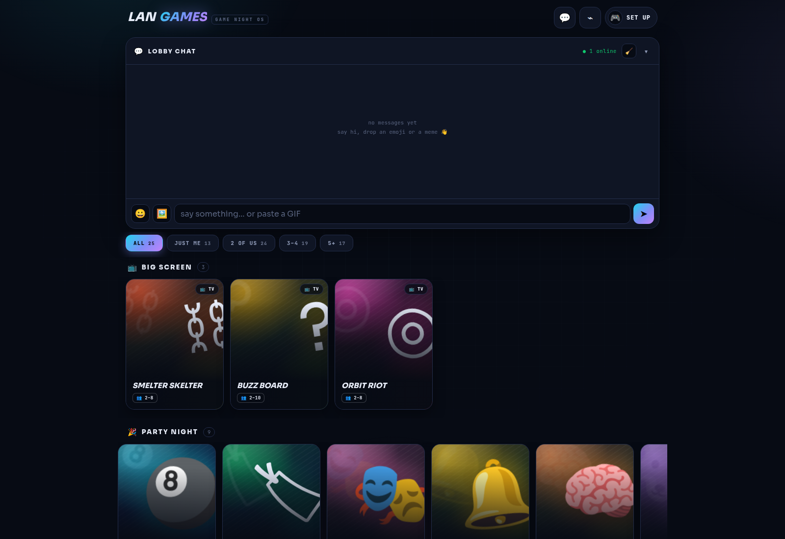
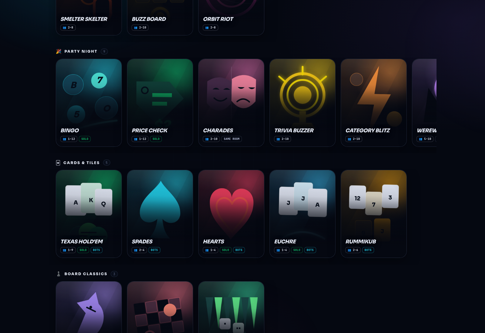

# LAN Games

A self-hosted **game hub for your local network**. One page, 24 games, bots to
fill empty seats, shared identity across every game. Everyone plays from their
own phone/laptop on the same Wi‑Fi — **no accounts, no cloud, no build step.**

Run it on any always-on box on your LAN (a spare laptop, a Raspberry Pi, a home
server), open the URL on everyone's phones, and you've got game night.

### 90-second tour

https://github.com/user-attachments/assets/a2978668-e6b8-43a6-a720-2ccf3a6e20d0

<sub>(A copy also ships in the repo as
`2026-07-17_LAN-GAMES_explainer_web.mp4`.)</sub>




---

## The games

- **Big Screen** (one TV, every phone is a controller) — Smelter Skelter
  (live hook-and-reel pendulum physics), Buzz Board (clue picking, buzzing,
  and secret wagers), Bingo, Price Check, Orbit Riot (simultaneous cosmic
  billiards + pinball physics)
- **Cards** — Texas Hold'em (No‑Limit, real side pots & all‑in showdowns),
  Spades, Hearts, Euchre, Rummikub
- **Board** — Chess, Checkers, Backgammon, Connect Four (real rules engines)
- **Party** (same room, phones as controllers) — Charades, Trivia Buzzer,
  Category Blitz, Werewolf, Fam Feud
- **Battle** — Battleship, Tanks (2D artillery), Fort Fling (two-player
  slingshot weapons), Snake Arena
- **Word** — WordClash (multiplayer Wordle: duel / relay / sabotage)

Many card, board, and action games include **bots**, so small groups can fill a
table with AI. Social games and dedicated human duels clearly show the players
they require.

---

## Quick start

Requires **Python 3.10+**. On the machine that will host the games:

```bash
git clone https://github.com/BEACNpool/LAN-Games.git
cd LAN-Games
python3 -m venv .venv
source .venv/bin/activate          # Windows: .venv\Scripts\activate
pip install -r requirements.txt
python server.py
```

That starts the hub on **port 8096**. Now open it from any device on the same
network:

```
http://<the-host-ip>:8096/
```

Find `<the-host-ip>` with `hostname -I` (Linux), `ipconfig getifaddr en0`
(macOS), or `ipconfig` (Windows) — e.g. `http://192.168.1.50:8096/`. Share that
URL with everyone in the room; they open it, pick a name + avatar, and join.

Once the hub is open, tap the **join-link button** beside your profile. It shows
a QR code for the exact address you opened, so everyone else can scan it instead
of typing an IP address. The QR is generated in the browser; it does not call an
outside service.

> **Tip:** give the host a static IP (or a hostname on your router) so the URL
> doesn't change, and bookmark it on everyone's phones.

## Make it yours

Everything specific to *your* house — the name on the wordmark, your guest
Wi-Fi, a game renamed as your family's in-joke — lives in **`data/venue.json`**,
which is gitignored. Nothing personal ever belongs in a tracked file.

```bash
cp venue.example.json data/venue.json   # then edit it
```

```json
{
  "brand": {
    "name": "SMITH FAMILY ARCADE",
    "presents": "SMITH FAMILY ARCADE PRESENTS",
    "titles": { "famfeud": "SMITH FEUD" }
  },
  "wifi": { "ssid": "guest-wifi", "password": "hunter2", "security": "WPA" }
}
```

- **`brand.name`** replaces the wordmark in page titles.
- **`brand.presents`** is the big-screen splash kicker.
- **`brand.titles`** renames individual games, keyed by registry slug.
- **`wifi`** fills in the 📶 button on the hub, which shows a QR that joins your
  network — guests scan it, then scan the games QR. Set `"hidden": true` for a
  non-broadcast SSID, or phones won't join from the scan.

The 📶 button is always there; until you configure it, it renders blank and
tapping it shows these setup instructions in-app.

Every key is optional. With no `venue.json` at all the hub reads as the generic
"LAN GAMES" with an unconfigured Wi-Fi button — which is exactly what a fresh
clone should look like.

> **Anyone on your LAN who opens the hub can read the Wi-Fi password.** That's
> the point of the feature, but put your *guest* SSID there, not your main one.

### Keeping personal data out of the repo

If you contribute back, install the pre-push guard once per clone:

```bash
./ops/install_hooks.sh
```

It runs `tests/test_no_private_data.py`, which scans every **tracked** file for
branding, LAN addresses, home paths, hostnames, emails and credentials, and
**refuses the push** if it finds any. It also runs in the normal `pytest` suite.
That way a personalization can't reach the public repo by accident.

### Best phone setup

- Keep every phone on the same Wi-Fi as the host.
- Open the hub with the host's **LAN IP or LAN hostname**, not `localhost`,
  before showing the QR code.
- Add the hub to the home screen (or bookmark it) for an app-like, full-height
  launch. Some Android browsers require HTTPS before they offer a formal
  “Install app” prompt; a home-screen bookmark still works on a plain LAN.
- Set your name, character, and optional photo once on the hub. That profile is
  reused by every game on that device.

---

## Run it as a service (optional, Linux)

So the hub survives reboots, install it as a **systemd user service**:

```bash
mkdir -p ~/.config/systemd/user
cp deploy/gamehub.service ~/.config/systemd/user/lan-games.service
# edit WorkingDirectory / ExecStart paths in that file to match where you cloned it
systemctl --user daemon-reload
systemctl --user enable --now lan-games.service
loginctl enable-linger "$USER"     # keep it running when you're not logged in
```

Check it: `systemctl --user status lan-games` · logs: `journalctl --user -u lan-games -f`.

---

## How it works

Two‑layer, cleanly split — game rules never touch sockets; the net layer never
touches rules:

```
core/session.py    GameSession base — player identity, ready/GO lobby,
                   3‑2‑1 countdown, a single (deadline, gen) timer, fx events,
                   bot players. Pure, synchronous, IO‑free.
core/net.py        GameBinding — per‑game WebSocket, personalized state pushes,
                   the timer task, and the bot scheduler.
games/registry.py  THE registry: one entry per game mounts its WS + client.
games/<slug>/      a game = a GameSession subclass + a web/ client dir.
web/               the hub page + shared design system + client runtime.
server.py          FastAPI app; loops the registry and mounts everything.
```

Game logic is **pure Python** (no external services); the clients are vanilla
JS/CSS served static (no bundler). Adding a game is one registry entry + one
directory — see **[ADDING_A_GAME.md](ADDING_A_GAME.md)** for the full guide, and
copy `games/_template/` (HIGH CARD, the smallest complete game) to start.

## Tests

```bash
pip install pytest
python -m pytest -q                                  # unit tests for every game
node tests/playtest_<game>.mjs http://127.0.0.1:8096 # headless browser playtest
```

## License

[MIT](LICENSE) — clone it, fork it, run it on your LAN, make it yours.
